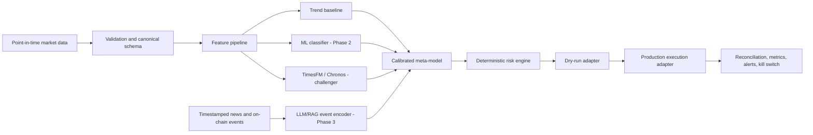

# Reference architecture

Phase 1 deliberately implements only the shaded research path: validated OHLCV,
features, a conservative baseline, realistic one-way costs, and chronological
evaluation. Live execution is not enabled.

## Non-negotiable boundaries

1. A close-derived signal is shifted one full bar before earning returns.
2. LLM output is constrained data, never a direct order.
3. Forecasting models cannot override position and drawdown limits.
4. Exchange adapters are replaceable; strategy logic never imports a specific venue SDK.
5. Research, dry-run and live use the same signal contract, but live activation requires a separate release gate.
