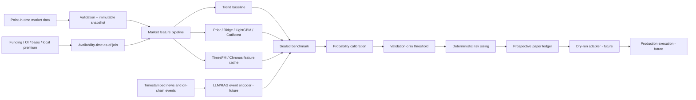

# Reference architecture

Phase 2B implements the research path only. Live execution remains outside the
package until the release gates are satisfied.

## Non-negotiable boundaries

1. Every source defines event time and availability time.
2. A label is used only after its outcome was observable.
3. Calibration and threshold selection have separate chronological partitions.
4. Final test cannot influence a feature, model, prompt, threshold, or cost assumption.
5. Foundation models are feature generators, never order generators.
6. LLM output is constrained event data and cannot override risk limits.
7. Exchange adapters are replaceable and do not leak into research logic.
8. Every test fold is liquidated and charged before the next fold starts.
9. A historical result cannot pass the prospective-evidence gate by itself.
